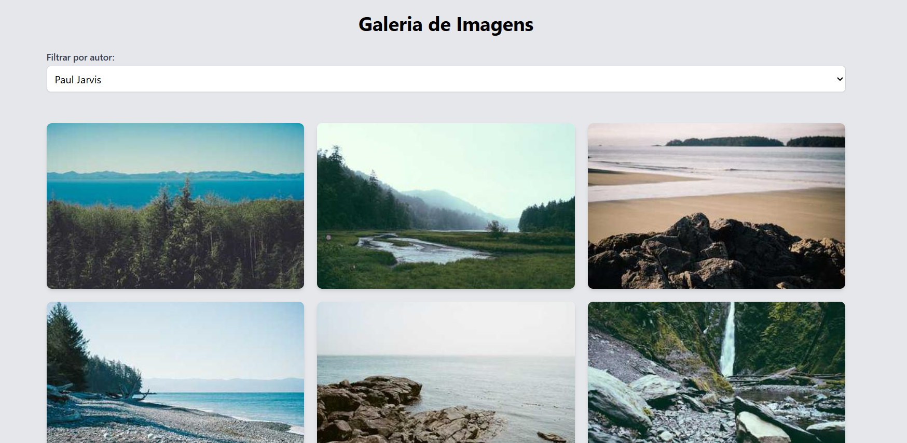
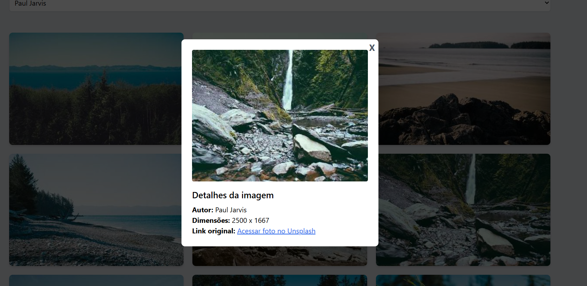

## Galeria de Imagens com React

Uma aplicação web de galeria de imagens construída com React, utilizando a API do Picsum Photos. Permite visualizar imagens, favoritar, aplicar filtros e acessar informações detalhadas sobre cada imagem.

### ✨ Funcionalidades
- Visualização de imagens da API Picsum Photos
- Favoritar imagens
- Filtro por autor
- Modal com detalhes da imagem
- Estilização com Tailwind CSS
- Totalmente responsivo e acessível
- Animações suaves ao abrir modais

### 💻 Tecnologias Utilizadas
- React
- Vite
- Tailwind CSS
- Context API
- Fetch API

### 📦 Instalação
- Clone o repositório:
```bash
git clone https://github.com/seu-usuario/seu-repo.git
cd seu-repo
```

- Instale as dependências:
```bash
npm install
```

- Inicie o servidor de desenvolvimento:
```bash
npm run dev
```

A aplicação estará disponível em http://localhost:5173


## 🗂️ Estrutura de Pastas
```css
src/
├── components/
│   ├── Card.jsx
│   ├── Gallery.jsx
│   ├── Modal.jsx
│   └── Filter.jsx
├── pages/
│   └── Home.jsx
├── App.jsx
├── main.jsx
└── index.css
```

## 📱 Responsividade

O layout é responsivo, adaptando-se a diferentes tamanhos de tela (mobile, tablet e desktop) usando utilitários do Tailwind CSS.


## 🌐 SEO
- Utilização adequada de tags semânticas
- Título e meta tags otimizadas

## 📸 Preview




## Criado por:

- Elane Alencar
- [Linkedin](https://linkedin.com/in/elanealencar)
- [Portfólio](https://portfolio-elanealencar.vercel.app/)